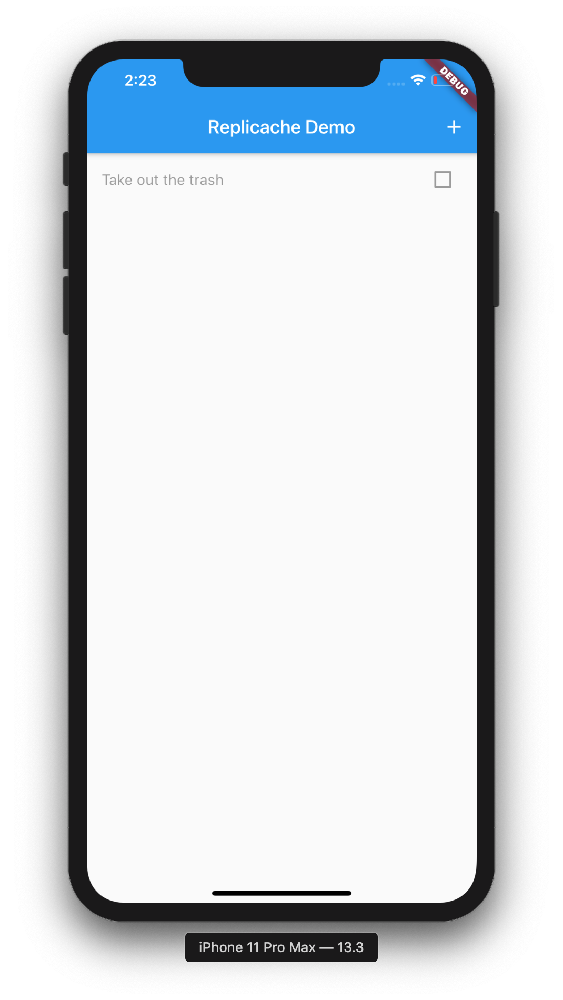
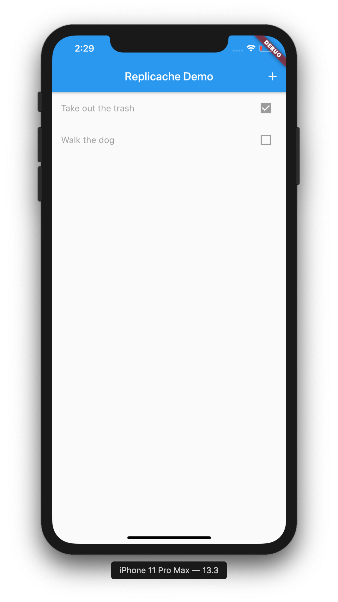
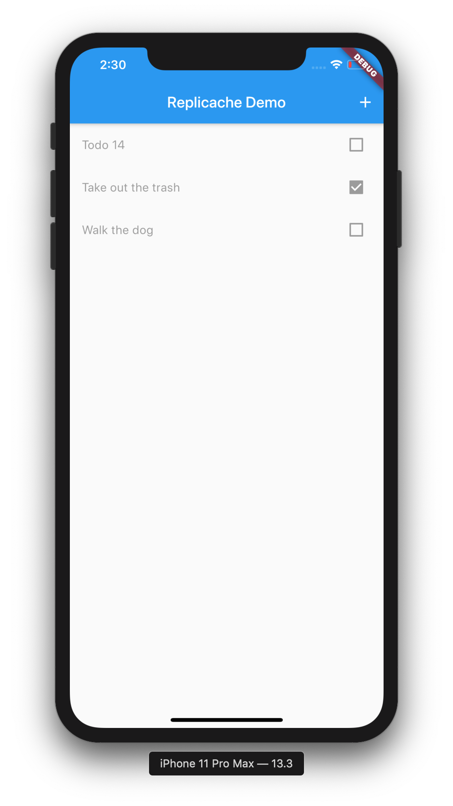

# Replicache Flutter SDK


# Quickstart

Hi! This tutorial walks through creating a basic offline-first todo app in Flutter with Replicache.

If you have any problems working through this, or just have questions, please [join us on Slack](https://join.slack.com/t/rocicorp/shared_invite/zt-ekh3oxbq-FzzB7qP9lwqdTvBjxXU2oA). We'd be happy to help.

**Note:** This document assumes you already know what Replicache is, why you might need it, and broadly how it works. If that's not true, see the [Replicache homepage](https://replicache.dev) for an overview, or the [design document](https://github.com/rocicorp/replicache/blob/master/design.md) for a detailed deep-dive.

### 1. Get the SDK

Download and unzip the latest SDK release:

```bash
curl -o replicache-sdk-flutter.zip -L https://github.com/rocicorp/replicache-sdk-flutter/releases/latest/download/replicache-sdk-flutter.zip
unzip replicache-sdk-flutter.zip
```

### 2. Start a new, empty Flutter app

```bash
flutter create todo
```

### 3. Add the `replicache` dependency to your Flutter app's `pubspec.yaml`

Add the following lines to the `dependencies` section of `pubspec.yaml`:

```yaml
  replicache:
    path:
      /path/to/replicache-sdk-flutter/
```

### 4. Get Your ClientID

Each instance of Replicache has a unique `ClientID` that is generated at first run. We'll need that value to populate data into the right cache.

To get it, replace the contents of `main.dart` with the following:

```dart
import 'package:flutter/material.dart';
import 'package:replicache/replicache.dart';

void main() => runApp(MyApp());

class MyApp extends StatelessWidget {
  final String _title = 'Replicache Demo';

  @override
  Widget build(BuildContext context) {
    return MaterialApp(
      title: _title,
      theme: ThemeData(
        primarySwatch: Colors.blue,
      ),
      home: MyHomePage(title: _title),
    );
  }
}

class MyHomePage extends StatelessWidget {
  MyHomePage({Key key, this.title}) : super(key: key) {
    var replicache = Replicache();
  }

  @override
  Widget build(BuildContext context) {
    return Text("Hi!");
  }
}
```

Then, launch the Flutter app:

```bash
cd todo
flutter pub get
flutter emulators --launch apple_ios_simulator
flutter run
```

In the console, you will see output like:

```bash
flutter: Replicache (native): 02 Jun 20 13:53:31.000 -1000 INF Opened Replicache instance at: /Users/aa/Library/Developer/CoreSimulator/Devices/66A73307-D0C6-4D9A-87A4-B2664A3F13CA/data/Containers/Data/Application/4FD702A2-84E8-4D47-82D6-F804702481F5/Library/Application Support/com.example.todo/replicache/aHR0cDovL2xvY2FsaG9zdDo3MDAxL3B1bGw with tempdir: /Users/aa/Library/Developer/CoreSimulator/Devices/66A73307-D0C6-4D9A-87A4-B2664A3F13CA/data/Containers/Data/Application/4FD702A2-84E8-4D47-82D6-F804702481F5/tmp and ClientID: o3mMfS36gUrMkw3jfoNWun db=http://localhost:7001/pull gr=17 req=open rid=1
flutter: Replicache: LogLevel.info: Error: Exception: Error invoking "beginSync": PlatformException(UNAVAILABLE, sync o3mMfS36gUrMkw3jfoNWun-5ed6e67b-1 failed: pull from http://localhost:7001/pull failed: Post "http://localhost:7001/pull": dial tcp [::1]:7001: connect: connection refused, null)
```

Search for `ClientID` in your console output and copy the corresponding value down. 

### 5. Start a development diff-server and put some data in it:

In a new console, download a copy of the development diff-server:

```bash
# For OSX
curl -o diffs -L https://github.com/rocicorp/diff-server/releases/latest/download/diffs-osx
chmod u+x diffs

# For Linux
curl -o diffs -L https://github.com/rocicorp/diff-server/releases/latest/download/diffs-linux
chmod u+x diffs
```

*(Note: You'll probably want to put `diffs` in your path somewhere as you'll be using it frequently.)*

Start `diffs` and leave it running:

```bash
/path/to/diffs --db=/tmp/foo serve --enable-inject
```

Then, in a third console, inject a snapshot of your Client View into diff-server.

The Client View must be key/value pairs, but the value part can be any valid JSON type. You decide the data you will need locally in your application.

```bash
CLIENT_ID=<your-client-id-from-step-4>
curl -d @- http://localhost:7001/inject << EOF
{
  "accountID": "sandbox",
  "clientID": "$CLIENT_ID",
  "clientViewResponse": {
    "clientView": {
      "/list/29597": {
        "id": 29597,
        "ownerUserID": 3
      },
      "/todo/14136": {
        "complete": false,
        "id": 14136,
        "listId": 29597,
        "order": 0.5,
        "text": "Take out the trash"
      },
      "lastTransactionID":"0"
    }
  }
}
EOF
```

### 6. Implement the App

Replace `main.dart` with:

```dart
import 'package:flutter/material.dart';
import 'package:replicache/replicache.dart';
import 'dart:io';
import 'dart:math';

void main() => runApp(MyApp());

class MyApp extends StatelessWidget {
  final String _title = 'Replicache Demo';

  @override
  Widget build(BuildContext context) {
    return MaterialApp(
      title: _title,
      theme: ThemeData(
        primarySwatch: Colors.blue,
      ),
      home: MyHomePage(title: _title),
    );
  }
}

class MyHomePage extends StatelessWidget {
  // Android emulator cannot use localhost.
  final diffsUrl = 'http://${Platform.isAndroid ? '10.0.2.2' : 'localhost'}:7001/pull';

  // You authenticate to the diff server with your account ID. To play around, use 'sandbox'.
  final diffsAuth = 'sandbox';
  final batchUrl = '';
  final dataLayerAuth = '';

  final String title;
  final _random = Random();
  Replicache _replicache;
  Mutator _createTodo;

  MyHomePage({Key key, this.title}) : super(key: key) {
    _replicache = Replicache(
      diffServerUrl: diffsUrl,
      diffServerAuth: diffsAuth,
      batchUrl: batchUrl,
      dataLayerAuth: dataLayerAuth,
    );

    // Tell Replicache to pull from the diff server every 10s. In a real app you'll have this be
    // far less frequent and typically pull only in response to a server push notification.  But
    // this is convenient for development.
    _replicache.syncInterval = Duration(seconds: 10);

    _replicache.onSync = (syncing) {
      if (syncing) {
        print('Syncing...');
      } else {
        print('Done.');
      }
    };

    _registerMutations();
  }

  void _registerMutations() {
    // Register a single mutator to create a new todo. A real todo app would have one of these for each
    // mutation that the UI needs.
    _createTodo = _replicache.register("createTodo", (tx, args) async {
      tx.put("/todo/${args["id"]}", args);
    });
  }

  void _handleAddTodo() async {
    var id = _random.nextInt(2^32-1);
    await _createTodo({"id": id, "listID": 1, "text": "Todo $id", "order": 1.0, "complete": false});
    _replicache.sync();
  }

  @override
  Widget build(BuildContext context) {
    return Scaffold(
      appBar: AppBar(
        title: Text(title),
        actions: <Widget>[
          IconButton(
            icon: const Icon(Icons.add),
            tooltip: 'Add Todo',
            onPressed: () {
              _handleAddTodo();
            },
          ),
        ],
      ),
      body: _getBody(context),
    );
  }
  
  Widget _getBody(BuildContext context) {
    return Center(
      child: StreamBuilder(
        stream: _replicache.subscribe((ReadTransaction tx) async {
          Iterable<ScanItem> res = await tx.scan(prefix: '/todo/');
          return res.map((event) => event.value as Map<String, dynamic>);
        }),
        builder:  (BuildContext context, AsyncSnapshot<Iterable<Map<String, dynamic>>> snapshot) {
          return Column(
            mainAxisAlignment: MainAxisAlignment.start,
            crossAxisAlignment: CrossAxisAlignment.start,
            children: List.from(
              (snapshot.data ?? []).map(
                (Map m) => CheckboxListTile(value: m['complete'], title: Text(m['text'])))),
          );
        },
      )
    );
  }
}
```

Reload or re-run the app. The initial Client View data appears:



🎉

#### Notes:

* We set a relatively frequent sync interval during development. For production applications, we recommend leaving this the default (1 minute) and syncing primarily in response to a server push. Most applications have to send such pushes anyway, e.g., to display notifications to the user.
* The `accountID` is your unique account ID on diff-server. During our early alpha testing, use `"sandbox"`.
* You'll setup `lastTransactionID` later in this tutorial. For now just return `0`.

### 7. Update Data

Now inject a new snapshot:

```bash
curl -d @- http://localhost:7001/inject << EOF
{
  "accountID": "sandbox",
  "clientID": "$CLIENT_ID",
  "clientViewResponse": {
    "clientView": {
      "/list/29597": {
        "id": 29597,
        "ownerUserID": 3
      },
      "/todo/14136": {
        "complete": true,
        "id": 14136,
        "listId": 29597,
        "order": 0.5,
        "text": "Take out the trash"
      },
      "/todo/9081": {
        "complete": false,
        "id": 9081,
        "listId": 29597,
        "order": 0.75,
        "text": "Walk the dog"
      },
      "lastTransactionID":"0"
    }
  }
}
EOF
```

You'll see your Flutter app update dynamically:



Huzzah!

### 8. Mutations

Add a Todo locally by pressing the "+" button in the top-right corner of the app. The change happens immediately and updates in the app:



### 9. Server Integration

Congratulations — you are done with the client setup! Time for a cup of coffee.

At this point, you are reading and writing locally, but you're not syncing with any server. To do that, you'll need to add your server implementation of the Replicache sync protocol. See [Replicache Server Quickstart](https://github.com/rocicorp/replicache#server-side) for instructions.

In the meantime you can hook your client up to our sample todo server by changing the URLs like so:

```dart
  final diffsUrl = 'https://serve.replicache.dev/pull';
  final diffsAuth = '1';
  final batchUrl = 'https://replicache-sample-todo.now.sh/serve/replicache-batch';
  final dataLayerAuth = '1';
```

Re-launch the app. The changes will be committed to the remote server.

## Next steps

- Implement the [server-side of Replicache integration](https://github.com/rocicorp/replicache/)
- See [`flutter/redo`](https://github.com/rocicorp/replicache-sdk-flutter/tree/master/sample/redo) a fully functioning TODO app built on Flutter and Replicache
- Review the [Replicache Dart Reference](https://replicache-sdk-flutter.now.sh/)
- Inspect your Replicache databases using [the `repl` tool](https://github.com/rocicorp/replicache-server/blob/master/doc/cli.md)

## More questions?

* [Join us on Slack!](https://join.slack.com/t/rocicorp/shared_invite/zt-ekh3oxbq-FzzB7qP9lwqdTvBjxXU2oA)
* See the [design doc](https://github.com/rocicorp/replicache/blob/master/design.md).
